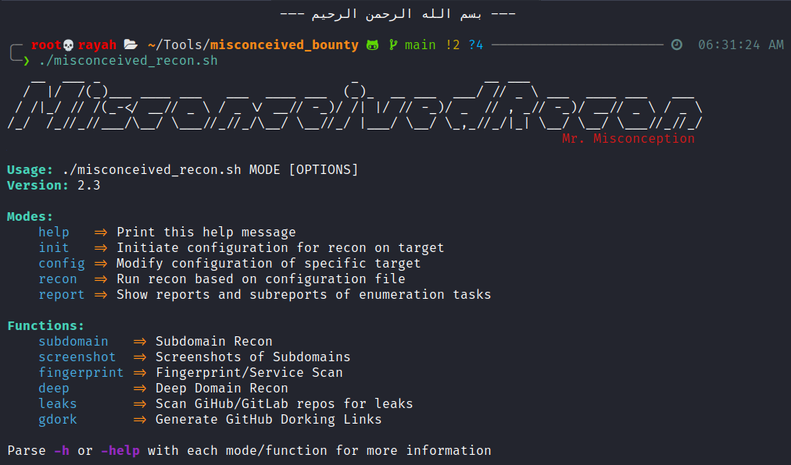

# MisconceivedRecon (`misconceived_recon.sh`)



> **NOTE:** I wrote this script for ME, not for you. You are free to use this script for your hunting, but I cannot guarantee that I will assist you with any issues you may face.

# Table of Contents

- [MisconceivedRecon (`misconceived_recon.sh`)](#misconceivedrecon-misconceived_reconsh)
- [Concept](#concept)
  - [Usage](#usage)
- [Requirements](#requirements)
- [Modes](#modes)
  - [`init`](#init)
    - [Description](#description)
  - [`config`](#config)
    - [Description](#description-1)
    - [Recon Reports Directory Structure](#recon-reports-directory-structure)
    - [Configuration files](#configuration-files)
  - [`recon`](#recon)
    - [Description](#description-2)
  - [`report`](#report)
    - [Description](#description-3)
  - [Standalone Functions](#standalone-functions)
    - [`subdomain`](#subdomain)
      - [Description](#description-4)
        - [Subdomain Discovery](#subdomain-discovery)
        - [Subdomain Takeover Detection](#subdomain-takeover-detection)
    - [`screenshot`](#screenshot)
    - [`fingerprint`](#fingerprint)
    - [`deep` (Deep Domain Recon)](#deep-deep-domain-recon)
    - [`leaks`](#leaks)
    - [`gdork`](#gdork)
- [TODO](#todo)

# Concept

I wrote this script because I wanted to have a script that will do three things (the first point is the main one):

1. Can be easily ran repeatedly on different targets
2. Will report back to me on Discord
3. Is easy to debug

So the script runs the chosen tasks, logs the output, and notifies me on reports by sending a message to my Discord server.

Main features:

- Stores all recon information in a single json configuration file
- Reports results to Discord
- Checks for internet connection before running each task, and waits for the connection
- Organizes reports according to their category
- Logs tool output to ease debugging

## Screenshots of some Discord integration
- 
- 


## Usage:
```bash
Usage: ./misconceived_recon.sh MODE [OPTIONS]
Version: 2.3

Modes:
    help   => Print this help message
    init   => Initiate configuration for recon on target
    config => Modify configuration of specific target
    recon  => Run recon based on configuration file
    report => Show reports and sub-reports of enumeration tasks

Functions:
    subdomain   => Subdomain Recon
    screenshot  => Screenshots of Subdomains
    fingerprint => Fingerprint/Service Scan
    deep        => Deep Domain Recon
    leaks       => Scan GiHub/GitLab repos for leaks
    gdork       => Generate GitHub Dorking Links

Parse -h or -help with each mode/function for more information
```
# Requirements

> All these programs are expected to be in `$PATH` and will be called as named in this list

- [`anew`](https://github.com/tomnomnom/anew)
- [`bat`](https://github.com/sharkdp/bat)
- [`colordiff`](https://www.colordiff.org/)
- [`crt.sh`](https://github.com/MisconceivedSec/crt.sh)
- [`discord.sh`](https://github.com/fieu/discord.sh)
- [`dnsreaper`](https://github.com/punk-security/dnsReaper)
- [`feroxbuster`](https://github.com/epi052/feroxbuster)
- [`github-subdomains`](https://github.com/gwen001/github-search/blob/master/github-subdomains.py) (requires GitHub Access Token)
- [`gitrob`](https://github.com/michenriksen/gitrob) (requires GitHub/GitLab Access Token)
- [`goaltdns`](https://github.com/subfinder/goaltdns)
- [`gobuster`](https://github.com/OJ/gobuster)
- [`gowitness`](https://github.com/sensepost/gowitness)
- [`httprobe`](https://github.com/tomnomnom/httprobe)
- [`nmap`](https://nmap.org/download)
- [`nslookup`](https://www.nslookup.io/)
- [`nuclei`](https://github.com/projectdiscovery/nuclei) & [`nuclei-templates`](https://github.com/projectdiscovery/nuclei-templates)
- [`secretfinder`](https://github.com/m4ll0k/SecretFinder)
- [`shodan`](https://cli.shodan.io/) (requires API key)
- [`subdomainizer`](https://github.com/nsonaniya2010/SubDomainizer)
- [`subfinder`](https://github.com/projectdiscovery/subfinder)
- [`trufflehog`](https://github.com/trufflesecurity/trufflehog) (requires GitHub/GitLab Access Token)
- [`waybackurls`](https://github.com/tomnomnom/waybackurls)
- [`whois`](https://www.kali.org/tools/whois/)
- [`xclip`](https://github.com/astrand/xclip)

# Modes
## `init`
```
Usage: ./misconceived_recon.sh init [OPTIONS]

Flags:
  -t -target <domain>
         Mandatory: Target domain
  -ght -github-token <token>
         Mandatory: GitHub Access Token
  -sr -scope-regex <regex>
         Regex to filter for in-scope domains
  -b -brute-wordlists <file[,file,...]>
         Wordlist(s) for subdomain brute-forcing
  -ghr -github-recon <url[,url,...]>
         GitHub Repos to enumerate
  -glt -gitlab-token <token>
         GitLab Token
  -glr -gitlab-recon <url[,url,...]>
         GitLab Repos to enumerate
  -p -path <path>
         Path to recon report directory
  -ct -custom-tasks <task[,task,...]>
         Custom task sequence
  -d -deep-domains <domain> <wordlist>
         Domains preform to deep recon on
  -ws -subdomain-webhook <url>
         Subdomain Webhook
  -wc -screenshots-webhook <url>
         Screenshots Webhook
  -wf -fingerprint-webhook <url>
         Fingerprint/Services Webhook
  -wd -deep-domain-webhook <url>
         Deep Domain Webhook
  -wl -leaks-webhook <url>
         Leaks Webhook
  -wg -logs-webhook <url>
         Logs Webhook
  -h -help
         Standalone: Print this help message

(Must provide all webhooks together, or none at all)

Available Recon Tasks:
  subdomain
  screenshot
  fingerprint
  deep_domains
  leaks
```
### Description
The `init` function is used to initiate a configuration file and folder for a specified target, it requires **two** arguments:

- `-t -target`: The target domain (Must be base domain, not a subdomain nor a URL e.g. *hackerone.com*)
- `-ght -github-token token`: A GitHub Access Token

The other optional arguments are:

- `-b -brute-wordlists file[,file,...]`
   - Wordlist(s) for subdomain brute-forcing, comma separated
- `-ghr -github-recon url[,url,...]`
   - GitHub Repos to enumerate
- `-glt -gitlab-token token`
   - GitLab Access Token
- `-glr -gitlab-recon url[,url,...]`
   - GitLab Repos to enumerate, comma separated (Requires GitLab Access Token)
- `-p -path path`
   - Path to recon reports **parent** directory (default is `.`)
- `-ct -custom-tasks task[,task,...]`
   - Custom task sequence
- `-d -deep-domains domain wordlist`
   - Domains to preform deep recon on
- `-ws -subdomain-webhook url`
   - Subdomain Discord channel webhook
- `-wc -screenshots-webhook url`
   - Screenshots Discord channel webhook
- `-wf -fingerprint-webhook url`
   - Fingerprint/Services Discord channel webhook
- `-wd -deep-domain-webhook url`
   - Deep Domain Discord channel webhook
- `-wl -leaks-webhook url`
   - Leaks Discord channel webhook
- `-wg -logs-webhook url`
   - Logs Discord channel webhook
- `-h -help`
   - Print the help message

## `config`
```bash
Usage: ./misconceived_recon.sh config [OPTIONS]

Flags:
  -c -config-file <file>
         Mandatory: <Configuration file for target>
  -t -target <domain>
         Change target domain
  -sr -scope-regex <regex>
         Regex to filter for in-scope domains
  -b -brute-wordlists <file[,file,...]>
         Add wordlist(s) for subdomain brute-forcing
  -ght -github-token <token>
         Change GitHub Token
  -ghr -github-recon <url[,url,...]>
         Add GitHub Repos to enumerate
  -glt -gitlab-token <token>
         Change GitLab Token
  -glr -gitlab-recon <url[,url,...]>
         Add GitLab Repos to enumerate
  -a -attack-method <task[,task,...]>
         Change task sequence
  -d -deep-domains <domain> <wordlist>
         Add domains for deep recon
  -ws -subdomain-webhook <url>
         Change Subdomain Webhook
  -wc -screenshots-webhook <url>
         Change Screenshots Webhook
  -wf -fingerprint-webhook <url>
         Change Fingerprint/Service Webhook
  -wd -deep-domain-webhook <url>
         Change Deep Domain Webhook
  -wl -leaks-webhook <url>
         Change Leaks Webhook
  -wg -logs-webhook <url>
         Change Logs Webhook
  -m -manual [editor]
         Standalone: Edit the config file manually (default editor 'nano')
  -h -help
         Standalone: Print this help message

Available Recon Tasks:
  subdomain
  screenshot
  fingerprint
  deep_domains
  leaks
```
### Description
The `config` function helps configure a specified configuration file.
<br>Without optional arguments, the configuration file will be printed out to the terminal.
<br>After a change is made, the config file is printed out to the terminal

It requires **one** argument:

- `-c -config-file file`
   - The path to a configuration

The other optional arguments:

- `-t -target domain`
   - Change target domain
- `-b -brute-wordlists file[,file,...]`
   - Add wordlist(s) for subdomain brute-forcing, comma separated
- `-ght -github-token token`
   - Change GitHub Access Token
- `-ghr -github-recon url[,url,...]`
   - Add GitHub Repos to enumerate
- `-glt -gitlab-token token`
   - Change GitLab Access Token
- `-glr -gitlab-recon url[,url,...]`
   - Add GitLab Repos to enumerate
- `-a -attack-method task[,task,...]`
   - Change task sequence
- `-d -deep-domains domain wordlist`
   - Add domains for deep recon
- `-ws -subdomain-webhook url`
   - Change Subdomain Discord channel webhook
- `-wc -screenshots-webhook url`
   - Change Screenshots Discord channel webhook
- `-wf -fingerprint-webhook url`
   - Change Fingerprint/Service Discord channel webhook
- `-wd -deep-domain-webhook url`
   - Change Deep Domain Discord channel webhook
- `-wl -leaks-webhook url`
   - Change Leaks Discord channel webhook
- `-wg -logs-webhook url`
   - Change Logs Discord channel webhook
- `-n -nano`
   - **Standalone:** Edit the config file manually using nano
- `-h -help`
   - **Standalone:** Print the help message

### Recon Reports Directory Structure
Example reports directory tree for target `example.com`:
```
./example_recon
├── deep_domains
├── example_config.json
├── fingerprint
├── leaks
│   ├── github
│   └── gitlab
├── logs
├── screenshots
└── subdomains
```

### Configuration files
The configuration file is in the `json` format.<br>
It is stored in the root of the recon reports directories.

An example config file is:
```json
{
  "config": {
    "target": "example.com",
    "scope_regex": "regex",
    "recon_path": "/tmp/example_recon",
    "subdomain_brute_wordlist": [
      "/usr/share/seclists/Discovery/DNS/namelist.txt"
    ],
    "deep_domains": [
      {
        "domain": "example.com",
        "wordlist": "/usr/share/seclists/Discovery/Web-Content/big.txt"
      }
    ],
    "git": {
      "token": {
        "github": "github_token",
        "gitlab": "gitlab_token"
      },
      "github_recon": [
        "https://github.com/user/repo"
      ],
      "gitlab_recon": [
        "https://gitlab.com/user/repo"
      ]
    },
    "attack_method": [   
      "subdomain",
      "screenshot",
      "fingerprint",
      "deep_domains",
      "leaks"
    ],
    "webhooks": {
      "subdomain": "https://discord.com/api/webhooks/...",
      "screenshot": "https://discord.com/api/webhooks/...",
      "fingerprint": "https://discord.com/api/webhooks/...",
      "deep_domain": "https://discord.com/api/webhooks/...",
      "leaks": "https://discord.com/api/webhooks/...",
      "logs": "https://discord.com/api/webhooks/..."
    }
  }
}                    
```
## `recon`
```
Usage: ./misconceived_recon.sh recon|subdomain|screenshot|fingerprint|deep|leaks|gdork [OPTIONS]

Flags:
  -c -config-file file                    Mandatory: Configuration file for target
```
### Description

The `recon` function takes one argument (-c -config-file).<br>
It preforms the tasks as specified in the configuration file under `attack_method`:
```json
"attack_method": [   
   "subdomain",
   "screenshot",
   "fingerprint",
   "deep_domains",
   "leaks"
]
```

## `report`
```bash
Usage: ./misconceived_recon.sh report [OPTIONS]

Flags:
  -c -config-file <file>
         Mandatory: Configuration file for target
  -r -report <report>
         Specify report
  -s -sub-report <sub-report>
         Specify sub-report
```
### Description

The `report` function scans the directories for available reports and outputs selected ones

## Standalone Functions
```
Usage: ./misconceived_recon.sh recon|subdomain|screenshot|fingerprint|deep|leaks|gdork [OPTIONS]

Flags:
  -c -config-file file
      Mandatory: Configuration file for target
```
### `subdomain`
#### Description

The `subdomain` function takes one argument (-c -config-file).<br>
It preforms subdomain enumeration.
The following tools are executed:

##### Subdomain Discovery

1. `crt.sh`
2. `subfinder`
3. `github-subdomains.py`
4. `gobuster` (brute-force)
5. `subdomainizer.py`
6. `subfinder` (recursive)
7. `goaltdns`
8. `httprobe` (Verifies that the subdomains are alive)

##### Subdomain Takeover Detection

1. `dnsreaper`
2. `nuclei -tags takeover`

### `screenshot`

The `screenshot` function takes screenshots of all Live Subdomains using `gowitness`

### `fingerprint`

The `fingerprint` function produces the following reports:

1. `whois`
2. `shodan`
3. `nmap`

### `deep` (Deep Domain Recon)

The `deep_domain_recon` function runs the following recon tasks:

1. `waybackurls`
2. `feroxbuster`
3. `secretfinder`

### `leaks`

The `leaks` function looks for leaked credentials and sensitive files in provided GitHub and GitLab repositories and users.

It runs the following tools:

1. `gitrob`
2. `trufflehog`

### `gdork`

The `gdork` function generates github dorking links, copies them to the clipboard, and stores them to `$recon_dir/github_dorking_links.txt`

# TODO

- [ ] Add `logs` function so one doesn't have to fiddle with the terribly named log files
- [ ] Change the use of `file.old` to `/old/file.txt`
- [ ] Add web technology fingerprinting to the `fingerprint` function
- [ ] Add more `nuclei` vulnerability scans
- [ ] Add a local registry that contains names of targets as well as their configuration files (maybe a `register` function)
- [ ] Add pager option (output like `less`) to `report` function
